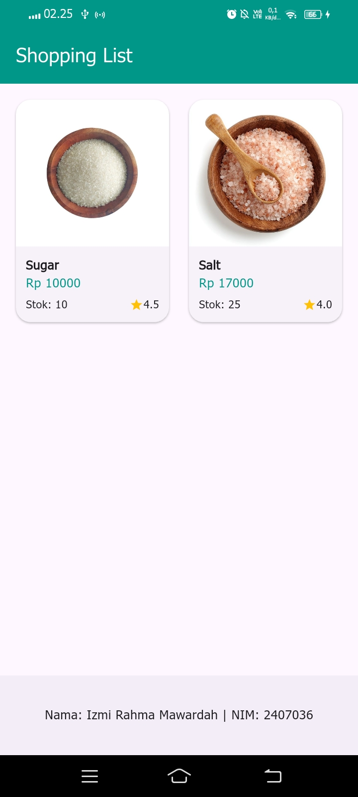
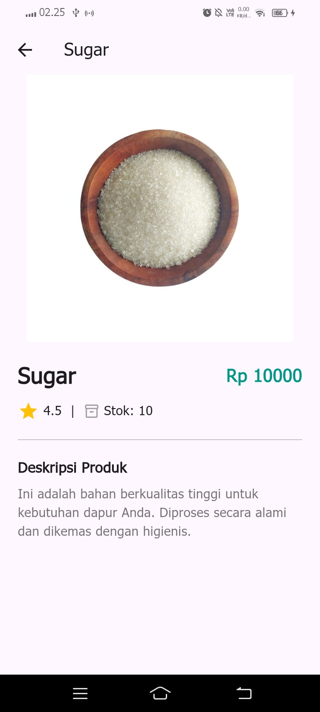

# Laporan Praktikum 5: Navigasi dan Rute
Aplikasi ini merupakan hasil praktikum mata kuliah Pemrograman Aplikasi Bergerak yang berfokus pada implementasi navigasi deklaratif menggunakan go_router, penggunaan widget GridView, serta penerapan animasi transisi dengan Hero widget.

### Identitas Mahasiswa
Nama: Izmi Rahma Mawardah

NIM: 2407036

Program Studi: Sistem Informasi Kota Cerdas (SIKC)

Instansi: Politeknik Negeri Indramayu

### Fitur dan Implementasi
1. Navigasi Deklaratif (go_router)
Aplikasi ini telah bermigrasi dari navigasi manual (Navigator.push) ke navigasi deklaratif menggunakan paket go_router. Konfigurasi rute dipusatkan pada file main.dart, yang memungkinkan manajemen alamat halaman yang lebih bersih dan efisien.

2. Tampilan GridView Responsif
Halaman utama (HomePage) menampilkan daftar produk menggunakan GridView.builder dengan SliverGridDelegateWithMaxCrossAxisExtent. Tampilan ini telah dioptimalkan agar responsif dan menampilkan informasi utama produk seperti:

  * Nama Produk
  * Harga Produk
  * Rating Produk (Ikon Bintang)

3. Animasi Hero
Implementasi Hero widget pada gambar produk memberikan transisi visual yang halus saat pengguna berpindah dari halaman daftar (Home) ke halaman detail (Item).

4. Detail Produk Lengkap
Halaman ItemPage menampilkan seluruh informasi atribut dari model Item, meliputi:

  * Gambar Produk
  * Nama dan Harga
  * Rating dan Jumlah Stok
  * Deskripsi Produk
  * Tombol Kembali (Leading AppBar) untuk navigasi balik ke Home

### Dokumentasi Tampilan

